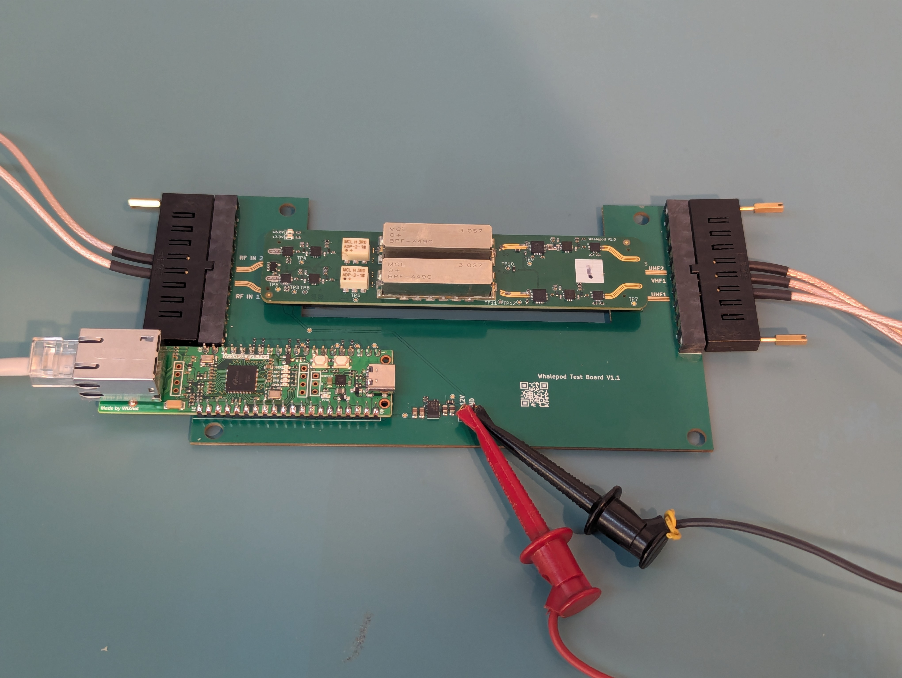

# Whalepod eval board — setup guide

This guide walks through unpacking, powering, and talking to a
Whalepod evaluation board for the first time.



---

## What's in the box

- Whalepod eval board
- Two Samtec RF cable assemblies — a 2-cable bundle (RF in) and a
  3-cable bundle (RF out)

You'll need to supply your own bench PSU capable of **12 V at 0.5 A**
(steady-state draw is ~0.25 A; 0.5 A gives margin for inrush).

---

## RF connections

Both RF bundles use Samtec edge connectors that mate to the headers
on either side of the board.

- **2-cable bundle → left side (RF in).** Top cable is **CH2**,
  bottom is **CH1**.
- **3-cable bundle → right side (RF out).** Top-to-bottom the cables
  are **UHF2**, **VHF1**, **UHF1**.

The silkscreen on the board (`RF IN 1` / `RF IN 2` on the left,
`UHF1` / `VHF1` / `UHF2` on the right) matches the cable order shown
in the test-setup photo above.

---

## Connecting power

Connect a 12 V supply to the headers labeled on the board (red to
`12V`, black to `GND`). Power on the supply — the board should draw
roughly **0.25 A at 12 V** in steady state.

---

## Connecting to a network

The Whalepod talks over Ethernet on TCP port 5000.

1. Plug a CAT5/CAT6 cable from the board's Ethernet jack to your
   network switch or directly to a host.
2. The board pulls an IP address via static IP.

<!--  -->


## First control commands

Download the `control_tool` binary for your platform (see the
[top-level README](../../README.md#install)). Then bring the board
into a known state and read it back:

```bash
control_tool --ip ocp_whalepod.local set-channels on
control_tool --ip ocp_whalepod.local set-att 0
control_tool --ip ocp_whalepod.local status
```

You should see something like:

```
--- Device RF Status ---
Board               : whalepod
Channels enabled    : true
Calibration enabled : false
Frontend atten (dB) : 0
```

If the Ethernet side isn't reachable yet (no DHCP, unknown static IP),
plug a USB cable into the eval board's USB-C port and use the USB
transport instead:

```bash
control_tool list                          # find the right /dev/tty… or COM port
control_tool --usb /dev/ttyACM1 status     # Linux example
```

---

## Reflashing the firmware

See [docs/firmware/README.md](../firmware/README.md) for the
drag-and-drop reflash procedure — it's the same across all Ocupoint
eval boards.

---

## Troubleshooting

**`ocp_whalepod.local` doesn't resolve.**
Confirm the board has pulled a DHCP lease, or pass the raw IP:
`control_tool --ip 192.168.1.50 status`. On Windows, install Apple's
Bonjour Print Services to get mDNS resolution — or just skip mDNS and
talk to the board over USB with `--usb COM5` (see `control_tool list`
to find the right port).

**Connection refused / timeout.**
Make sure nothing else has port 5000 open to the board, and that no
firewall is blocking outbound TCP on your host.

---